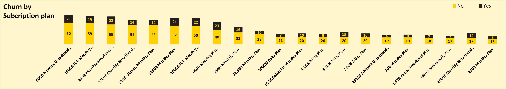
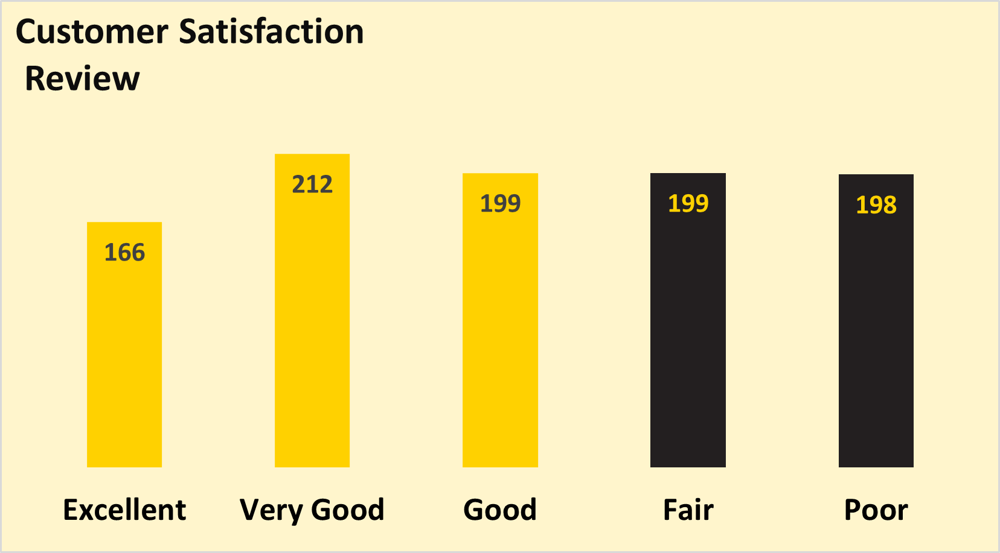

# MTN-Nigeria-Customer-Churn- Intelligence-Report-Q1-2025
An Excel dashboard analysis of MTN Nigeria Customer Churn behavior sequel to price hikes and changes in data plan.

---
## Problem Statement
Choosing an MTN data bundle today feels almost like a **CBT** (Computer Base Test).
After ***dialing*** ****312#*** Customers must carefully scroll through multiple confusing options before selecting a data plan.
This complexity,couple with recent hikes,has caused widespread customer frustration.

Many Customers either:
- **Downgrade to cheaper plan,or**
- **Churn to competitors**

Thus,this **Customer Churn Analysis** seeks to investigate and visualiize the trends behind this behavior and proffer actionable solutions. 

**Project Flow**

| Stage | Action |
|:------|:-------|
|**problem** | Confusing data bundles and price hikes|
| **Customer Reaction** | Downgrading or switching to competitors|
| **Investigation** | Churn rate,Retained customers behavior,Satisfaction levels |

---

**Investigation Focus Areas**

| Areas | Purpose |
| :-----| :-------|
| **Churn Rate** | Measures how many customers are leaving MTN |
| **Behaviors of Retained customers**| Analyze if customers are downgrading their data plans | 
| **Customers Satisfaction** | Assess public opinion after recent price hikes |

---

## Aims and Objectives 
This project is primarily to investigate the impact of  MTN's complex data bundle structures and recent price increases on customer behavior.
Using an Excel dashboard,Churn rate is explored through different categories,retention rate and customers satisfaction levels is quantified.
The goal is to provide actionable insights that could help MTN improve retention and customer loyalty.

---

## Data Source 
The dataset used for this project is available on Kaggle.
Download data set @https://www.kaggle.com/datasets/oluwademiladeadeniyi/mtn-nigeria-customer-churn

---

## Dashboard preview 

---
## KPI'S Metrics
- **Total Customer:** **974**
- **Total Revenue:** **#199+**
- **Churn Rate:** **29%**
- **Retention Rate:71%**
- **Customer satisfaction Rate: 39%**
- **Top State by Users: Osun State**
- **Top Age group: 41 - 50 years**
- **Most Subscribed plan: 60GB Monthly Broadband plan**

---

## Key Dashboard Insights

### 1. Total Revenue Generated in Q1
 

- Revenue peaked in February but dropped drastically in March, indicating customer churn and reduced spending as a result of increases in data prices.
- **Recommendation:** Monitor the impact of tariff adjustments and improve customer communication to prevent sudden revenue loss.

---

### 2. Revenue Generated by Subscription Plan

- High-value plans contributed the most revenue, but there are signs that customers are either downgrading or exiting these plans.
- **Recommendation:** Protect premium users through loyalty discounts or added value offers to prevent revenue erosion.

---

### 3. Churn by Subscription Plan

- High data plans (e.g., 60GB Monthly) experienced the most churn, suggesting price-sensitive customers are either downgrading or switching providers.
- **Recommendation:** Offer flexible plans or bundles to high-usage customers to retain them even during pricing shifts.

---

### 4. Most Reasons for Churn by Customers
 

- Main churn drivers are high tariffs, better offers from competitors, and poor network service.
- **Recommendation:** Address pricing concerns, network improvements, and competitive bundling to reduce churn.

---

### 5. Customer Satisfaction Review

- Only 39% of customers rated MTN service as "Excellent" or "Very Good," while many rated it "Fair" or "Poor," indicating dissatisfaction post-tariff hike.
- **Recommendation:** Invest urgently in customer experience improvements, especially around pricing transparency and network quality.

---
## Additional Insights

- **Top MTN Devices Used:**
Broadband device users show higher loyalty compared to mobile-only users.
- **Churn by MTN Device:** SIM card users churn more; broadband device owners are more retained.
- **Churn by Age Group:** Highest churn seen among middle-aged (41–60) customers — a critical revenue segment.

---

## Tools and Procedure 
- **Ms Excel**
  - **Data cleaning using formulas & functions**
  - **Pivot tables**
  - **MTN Brand Colors & Logo integration**
  - **charts & Slicers**
    
  ---
  
## Conclusion

The analysis confirms that MTN's recent changes in data pricing and plan complexity have significantly impacted customer retention.  
To stabilize churn and improve customer loyalty, MTN should prioritize **price rebalancing**, **loyalty programs** for premium users, **improving service quality**, and **simplifying the customer journey** when purchasing data plans.

---
## About Me
I'm an aspiring Data Analyst passionate about answering business questions and uncovering business insights through storytelling and dashboard design. Currently developing my skills in Excel, with Power Bi & SQL in view - one project at a time.
*"The Journey of a thousand miles starts with a consistent step"*

