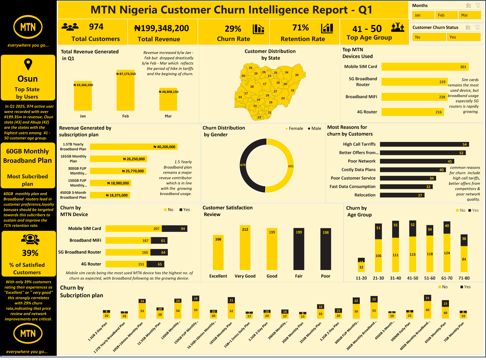

# MTN-Nigeria-Customer-Churn-Analysis-Report-Q1-2025
Excel dashboard analysis of MTN Nigeria Customer Churn behavior after price hikes and changes in data plan. 

## Problem-Statement
Choosing an MTN data bundle today feels almost like a **CBT** (Computer Base Test).

After ***dialing*** ****312#*** Customers must carefully scroll through multiple confusing options before selecting a data plan.
This complexity,couple with recent hikes, has caused widespread customer frustration.

Many Customers either:

- **Downgrade to cheaper plan,or**

- **Churn to competitors**

Thus,this **Customer Churn Analysis** seeks to investigate and visualiize the trends behind this behavior and proffer actionable solutions. 

**Project Flow**

| Stage | Action |
|:------|:-------|
| **problem** | Confusing data bundles and price hikes|
| **Customer reaction** | Downgrading or switching providers |
| **Investigation** | Churn rate,Retained customers behavior,Satisfaction levels |

**Investigation Focus Areas**

| Areas | Purpose |
| :-----| :-------|
| **Churn Rate** | Measures how many customers are leaving MTN |
| **Behaviors of Retained customers**| Analyze if customers are downgrading their data plans | 
| **Customers Satisfaction** | Assess public opinion after recent price hikes |

## Aims and Objectives 
This project is primarily to investigate the impact of  MTN's complex data bundle and recent price increase on customer behavior.
Using an Excel dashboard,Churn rate is explored through different categories,retention rate and customers satisfaction levels is quantified.
The goal is to provide actionable insights that could help MTN improve retention and customer loyalty.

## Data Source 

## Dashboard preview 

